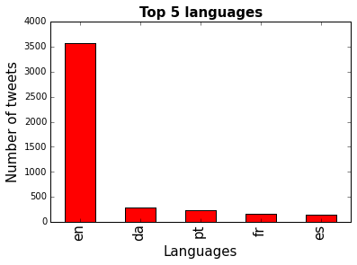
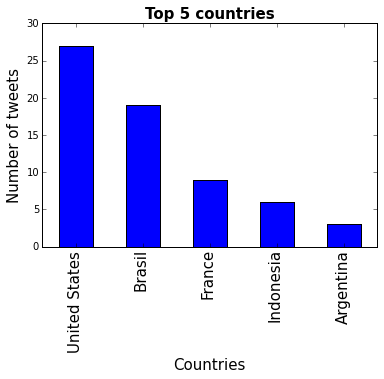
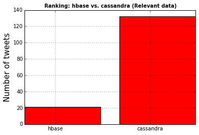

# ลองทำ Text Mining ด้วย Twitter Streaming API และ Python #
เราจะทำ text mining ด้วย twitter streaming api และ python เพื่อทำการดึงข้อมูลจากทวิตเตอร์มานับจำนวนทวีตเพื่อดูว่าระหว่าง Hbase กับ Cassandra คนพูดถึงคำไหนมากกว่ากันใน twitter 

เริ่มต้นด้วยการ import library ที่จะเป็นเข้ามาในไฟล์ครับ


```python
%matplotlib inline
import json
import pandas as pd
import matplotlib.pyplot as plt
import re
```

ทำการอ่านไฟล์ข้อมูลที่เราทำการเก็บมาครับ


```python
tweets_data_path = '../twitter_data.txt'

tweets_data = []
tweets_file = open(tweets_data_path, "r")

# Append Data to the variables
for line in tweets_file:
	try:
		tweet = json.loads(line)
		tweets_data.append(tweet)
	except:
		continue
```

ลองดูว่าเราอ่านมาได้ทั้งหมดเท่าไหร่


```python
print len(tweets_data)
```

    4807


### สร้าง DataFrame ด้วย pandas ###
ทำการสร้าง DataFrame ชื่อ tweets สำหรับจัดการกับข้อมูลที่ได้มาครับ


```python
# Create a table(dataframe) by pandas library
tweets = pd.DataFrame()

# Create 3 columns consist of text, lang, and country 
tweets['text'] = map(lambda tweet: tweet['text'], tweets_data)
tweets['lang'] = map(lambda tweet: tweet['lang'], tweets_data)
tweets['country'] = map(lambda tweet: tweet['place']['country'] if tweet['place'] != None else None, tweets_data)

```

ดูว่ามีภาษาอะไรบ้างที่เราได้ข้อมูลมา


```python
# Classify by lang
tweets_by_lang = tweets['lang'].value_counts()

fig, ax = plt.subplots()
ax.tick_params(axis='x', labelsize=15)
ax.tick_params(axis='y', labelsize=10)
ax.set_xlabel('Languages', fontsize=15)
ax.set_ylabel('Number of tweets' , fontsize=15)
ax.set_title('Top 5 languages', fontsize=15, fontweight='bold')
tweets_by_lang[:5].plot(ax=ax, kind='bar', color='red')
plt.show()
```





ลองดูข้อมูลตามประเทศ 5 อันดับแรก


```python
# Classify by country
tweets_by_country = tweets['country'].value_counts()

fig, ax = plt.subplots()
ax.tick_params(axis='x', labelsize=15)
ax.tick_params(axis='y', labelsize=10)
ax.set_xlabel('Countries', fontsize=15)
ax.set_ylabel('Number of tweets', fontsize=15)
ax.set_title('Top 5 countries', fontsize=15, fontweight='bold')
tweets_by_country[:5].plot(ax=ax, kind='bar', color='blue')
plt.show()
```





### สร้างฟังค์ชันสำหรับค้นหาคำที่อยู่ในข้อความ ###


```python
# This function return true if a word is found in text
def word_in_text(word, text):
	word = word.lower()
	text = text.lower()
	match = re.search(word, text)
	if match:
		return True
	return False
```

จัดกลุ่มข้อความระหว่าง Hbase กับ Cassandra


```python
# Add 2 columns in DataFrame
tweets['hbase'] = tweets['text'].apply(lambda tweet: word_in_text('hbase', tweet))
tweets['cassandra'] = tweets['text'].apply(lambda tweet: word_in_text('cassandra', tweet))
```

ดูจำนวนกันหน่อยว่าพูดถึงกันเยอะไหม


```python
print tweets['hbase'].value_counts()[True]
print tweets['cassandra'].value_counts()[True]
```

    50
    4603


ลองเอามาพลอตกราฟ เพื่อให้เห็นได้ง่ายขึ้น


```python
db_type = ['hbase', 'cassandra']
tweets_by_db_type = [tweets['hbase'].value_counts()[True],
					tweets['cassandra'].value_counts()[True]]
```


```python
x_pos = list(range(len(db_type)))
width = 0.8
fig, ax = plt.subplots()
plt.bar(x_pos, tweets_by_db_type, width, alpha=1,color='g')
ax.set_ylabel('Number of tweets', fontsize=15)
ax.set_title('Rankging: hbase vs. cassandra (Raw data)', fontsize=10, fontweight='bold')
ax.set_xticks([p + 0.4 * width for p in x_pos])
ax.set_xticklabels(db_type)
plt.grid()
plt.show()
```


ต่างกันเยอะเหมือนกันนะเนี่ย แต่ว่าข้อมูลนี้ยังเป็นข้อมูลดิบครับ Cassandra อาจจะเป็นชื่อดารา หรือ อะไรก็ได้ ดังนั้นเราต้องกรองก่อน

### กรองข้อมูล เอาเฉพาะที่เกี่ยวข้อง ###
เราจะกรองโดยใช้คำว่า "bigdata", "database", "parallel", "nosql"


```python
# Targeting relevant tweets
tweets['relevant'] = tweets['text'].apply(lambda tweet: word_in_text('bigdata', tweet) or word_in_text('database', tweet) or word_in_text('parallel',tweet) or word_in_text('nosql', tweet))
```

พอกรองมาแล้ว จำนวนลดลงอย่างมหาศาลเลย แต่นี่คือการกรองแบบคร่าวมาก ๆ ครับ


```python
print tweets[tweets['relevant'] == True]['hbase'].value_counts()[True]
print tweets[tweets['relevant'] == True]['cassandra'].value_counts()[True]
```

    21
    132


มาพลอตกราฟดูกันดีกว่า


```python
tweets_by_db_type = [tweets[tweets['relevant'] == True]['hbase'].value_counts()[True],
					 tweets[tweets['relevant'] == True]['cassandra'].value_counts()[True]]
```


```python
# x_pos = list(range(len(db_type)))
width = 0.8
fig, ax = plt.subplots()
plt.bar(x_pos, tweets_by_db_type, width, alpha=1, color='r')
ax.set_ylabel('Number of tweets', fontsize=15)
ax.set_title('Ranking: hbase vs. cassandra (Relevant data)', fontsize=10, fontweight='bold')
ax.set_xticks([p + 0.4 * width for p in x_pos])
ax.set_xticklabels(db_type)
plt.grid()
plt.show()
```





ก็ยังเยอะกว่ามากอยู่ดีครับจากกราฟ อาจจะมีเหตุผลจากหลายประการ เพราะกรองคำคร่าว ๆ หรือไม่ก็ Hbase อาจจะไม่ได้ถูกพูดถึงในช่วงเวลาที่เก็บข้อมูลครับ (22 กันยา 2558 - 23 กันยา 2558)

### ต่อไปมาทำการแตกข้อความหาลิงค์กันดีกว่า ###
เริ่มจากสร้างฟังค์ชั่นเพื่อหาลิงค์ครับ ตัดข้อความด้วย regular expression


```python
# Extracting links from the relevants tweets
def extract_link(text):
	regex = r'https?://[^s<>"]+|www\.[^s<>"]+'
	match = re.search(regex, text)
	if match:
		return match.group()
	return ''
```


```python
tweets['link'] = tweets['text'].apply(lambda tweet: extract_link(tweet))
```


```python
tweets_relevant = tweets[tweets['relevant'] == True]
tweets_relevant_with_link = tweets_relevant[tweets_relevant['link'] != '']
```

พอคัดลิงค์ได้แล้ว เอามาโชว์ซักหน่อยบางส่วน เผื่อจะตามไปดูกัน


```python
print tweets_relevant_with_link[tweets_relevant_with_link['hbase'] == True]['link']
print tweets_relevant_with_link[tweets_relevant_with_link['cassandra'] == True]['link']
```

    2                      http://t.co/aDIf6gqHTq #BigData
    25                     http://t.co/aDIf6gqHTq #BigData
    36                     http://t.co/aDIf6gqHTq #BigData
    40                                   http://t.co/cWnNd
    49                     http://t.co/mJyrmwN2to #BigData
    62                     http://t.co/aDIf6gqHTq #BigData
    72                                   http://t.co/cWnNd
    90                     http://t.co/aDIf6gqHTq #BigData
    1153                            http://t.co/1GbQweXtF1
    1229                 http://t.co/4DKBo9CcLM #DBaaS #Ca
    1230                 http://t.co/4DKBo9CcLM #DBaaS #Ca
    1410    http://t.co/irpaqoq8Pv #mongodb #dynamodb #hba
    1789                          http://t.co/f8pRTCGJ6e, 
    2380            http://t.co/zT4aErPE1V via @VMwareBlog
    2394             http://t.co/DJf5EdctM5 via VMwareBlog
    2406                          http://t.co/f8pRTCGJ6e, 
    2629                           https://t.co/v9hHEfBrTm
    2643            http://t.co/zT4aErPE1V via @VMwareBlog
    2646            http://t.co/zT4aErPE1V via @VMwareBlog
    3829                            http://t.co/3YPUaHqX3i
    4110        http://t.co/BO6XBlKMxw http://t.co/oUCI3n…
    Name: link, dtype: object
    13                                  http://t.co/0A5XO
    230                     http://t.co/UnANPrJ2yq #NoSQL
    477                            http://t.co/yvVuapAqyO
    523                   http://t.co/Ycpbn6Zfnp  by @mja
    549                            http://t.co/Pzl9AS1ILk
    687              http://t.co/5IfDJSdriq via @enterpri
    700                            http://t.co/ljuRqMpbVA
    766                            http://t.co/ty4NtyHtND
    767                            http://t.co/u9vACXMW3n
    828                            http://t.co/aRDYmoECUj
    833                            http://t.co/ZWga9bjpe2
    865                            http://t.co/gUoX2ultju
    887                            http://t.co/WdvjO1uyh4
    890                            http://t.co/JqFDYRajmw
    913                            http://t.co/BHeCfXIzCN
    965                            http://t.co/XTjBx3O8j4
    990                            http://t.co/FxMuw2Dbl8
    1024                           http://t.co/gUoX2ultju
    1084          http://t.co/QPf57vXGfl #BigDataAnalytic
    1164                       http://t.co/w9n7pdUx5u #Ca
    1181                       http://t.co/w9n7pdUx5u #Ca
    1186                       http://t.co/w9n7pdUx5u #Ca
    1191                       http://t.co/w9n7pdUx5u #Ca
    1219                       http://t.co/w9n7pdUx5u #Ca
    1229                http://t.co/4DKBo9CcLM #DBaaS #Ca
    1230                http://t.co/4DKBo9CcLM #DBaaS #Ca
    1262            http://t.co/KXHX3Y4jvv #bigdata #data
    1286                       http://t.co/w9n7pdUx5u #Ca
    1302                       http://t.co/F1Ojla6hMr #no
    1312           http://t.co/aEA7Mh762B via @SlideShare
                                ...                      
    3490                                      http://t.c…
    3491                                      http://t.c…
    3521                                 http://t.co/yvV…
    3530                                 http://t.co/yvV…
    3670    http://t.co/jzuSnzFcjZ http://t.co/gBJLP3Qo49
    3763                           http://t.co/HyuoLh01EY
    3829                           http://t.co/3YPUaHqX3i
    3997                                      http://t.c…
    4051                  http://t.co/gH5CoJ2fSW #bigdata
    4069                  http://t.co/H31hUafRCC #bigdata
    4110       http://t.co/BO6XBlKMxw http://t.co/oUCI3n…
    4149                                http://t.co/1QiKG
    4189                                      http://t.c…
    4394                       http://t.co/w9n7pdUx5u #Ca
    4434                            https://t.co/eY7P6ntL
    4460                       http://t.co/ekgNNco6Oa #ca
    4535                    http://t.co/vz1ReJgSFS - and 
    4537                           http://t.co/AdjeKeWuTj
    4595                             http://t.co/HyuoLh0…
    4605                    http://t.co/4TwOqgekjH #NoSQL
    4689                           http://t.co/BQnEyDtrg4
    4698                           http://t.co/yw1gMEIEAB
    4715                           http://t.co/m9CRgvSXgR
    4737                           http://t.co/TcQe2nz1n8
    4767                                http://t.co/uBqN1
    4773                             http://t.co/rgmGrC1…
    4778                           http://t.co/LTnXYapA7K
    4790                                http://t.co/uBqN1
    4791                           http://t.co/idXiKVYSkJ
    4798                       http://t.co/w9n7pdUx5u #Ca
    Name: link, dtype: object


### จบแล้ว  ##
ใครที่สนใจอ่านแบบเต็มได้ที่: http://lukkid.in.th/text-mining-with-twitter-api-and-python/

แหล่งอ้างอิง: http://adilmoujahid.com/posts/2014/07/twitter-analytics/

มีข้อเสนอแนะติชมได้เลยนะครับ ขอบคุณครับ
